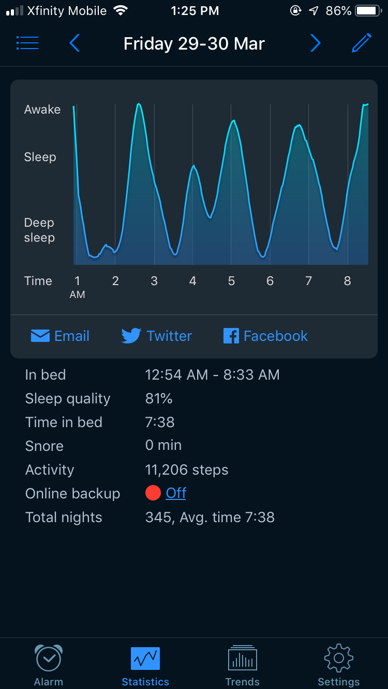
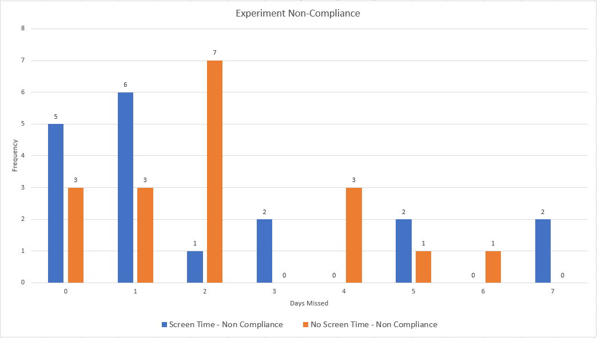

```{r setup, include=FALSE, message=FALSE, warning=FALSE}
knitr::opts_chunk$set(echo = F, fig.pos = 'H', fig.height = 3.5)
library(data.table)
library(magrittr)
library(ggplot2)
library(stargazer)
library(pwr)
library(sandwich)
library(multiwayvcov)
```

# Introduction

The importance of good sleeping habits has been emphasized frequently in contemporary advice. One aspect of good sleep hygiene is the avoidance of any electronic devices with backlit screens prior to bed. Light from electronic devices can cause the brain to stay active as if it is a daytime thereby inhibiting the production of the sleep hormone 'melatonin'. In this experiment, we seek a quantitative measure of sleep quality degradation as a result of screen-time before bed. Due to our limited expertise and resources for studying sleep science, we will perform the measurement using a mobile app.

# Research Question

_Does using electronic devices with a backlit screen thirty minutes prior to sleep have a statistically significant effect on the sleep quality as measured by a mobile app?_

# Hypothesis

We hypothesize that use of an electronic device with a screen for at least thirty minutes prior to going to sleep degrades the overall sleep quality for that night. The null hypothesis would correspondingly say that there is no statistical significance between screen time thirty minutes before going to bed and sleep quality.

As a correlary, we investigate whether refraining from electronics usage thirty minutes prior to going to sleep improves sleep quality for that night.

# Experimental Design

The mobile app that will be used for the experiment is called [Sleep Cycle](www.sleepcycle.com) and it utilizes the phone's microphone to measure the user's sleep cycles while in bed. It is primarily advertised for its alarm clock feature, which attempts to wake a user in the lightest phase of sleep within a preset time interval. Each morning, the app displays a graph of the user's sleep cycles for the previous night and some relevant statistics. Figure \ref{fig:example_night} shows an example of the output from one night's data.

```{r example_night, out.width='25%', fig.align='center', fig.cap='Example night'}

```

One of the statistics is the "Sleep Quality" number, which is the principle outcome variable for this experiment.  According to the *Sleep Cycle* website, the following four factors go into calculating Sleep Quality:

1. Amount of time spent in bed.
2. Amount of time spent in deep sleep.
3. Consistency of the sleep.
4. Amount of times where the app registered the person as fully awake.

Of the four factors, users generally have direct control only over the first one. We did not control the amount of time that users spend in bed, but we did instruct subjects to try to sleep at regular hours every night. As will be discussed later, compliance is a major issue in an experiment of this sort. We felt that tightly controlling the amount of time in bed would exacerbate the problem. The other three factors are hopefully affected by screen-time, allowing us to measure a treatment effect. The app also records a "snore" and "steps walked" value, but we have doubts about the accuracy of these measures and will not use them in our analysis.

The experiment took place over two weeks, from March 23 to April 5 of 2019. Saturday was chosen as the start day of the week because it was feared that instructions to change the sleeping habits in the middle of the week might be ignored. We recruited 35 people for the study using a Google survey (provided in the appendix), consisting of classmates, friends, and family. In addition to asking for contact and demographic information, the survey also inquired about general sleep habits such as bedtime and pre-sleep activities.  While the survey did ask about electronic usage, the questions also included workout habits and alcohol consumption. Prior to commencement of the experiment, subjects were not made aware of the fact that screen-time was the critical variable of interest.

All communications to subjects occurred over email. Every person in the same experimental group received identical emails (see Appendix). When instructing subjects to use electronic devices prior to bed, we did not mandate any specific activity, as we felt it would increase non-compliance on an already-intrusive study. We only specified that users should use some sort of electronic device with a backlit screen for 30 minutes immediately before bedtime. Similarly, we did not ask subjects in the other group to perform anything in lieu of electronic usage. These subjects were simply asked to refrain from using electronics with backlit screens 30 minutes before bedtime.

Subjects were randomly assigned to two groups, with group 1 receiving treatment (screen-time before bed) during the first week and group 2 receiving control (no screen-time before bed). After the first week, subjects were instructed to swap to the opposite activity of their original assignment. This swapping design allows us to perform within-subject comparisons while also leaving time for treatment effects to manifest themselves. With the group that received treatment first, we are also able to perform some analysis on persistence effects. Note that subjects were not informed of the instruction swap ahead of time, so we do not expect any anticipation effects.

The nature of the experiment requires effort from subjects in both treatment and control groups. That is, for people who normally use electronic devices before bed, the request to refrain from usage constitutes a significant change in pre-sleep ritual; for people who normally avoid electronics before bed, the opposite is true. Therefore, we are concerned with two-sided non-compliance, which is especially difficult to measure in this experiment because people are unlikely to honestly report when they have deviated from our instructions. To help combat this to an extent, we offered subjects some small monetary compensation and emphasized prioritization of honesty while reporting compliance data. Even so, we can never be sure of whether subjects followed our instructions or not.

## Experiment Deviations

After the initial sign-up survey, we asked all respondents to begin using the app (from March 14 to March 22 in a normal way so that we can collect the baseline data. Further, the app requires a minimum usage of 5 days to calibrate the sleep quality number. Sleep habits during this baseline usage were not closely controlled or monitored, as each subject signed up for the experiment on different dates. However, we did ask for an export of this baseline data prior to starting the experiment, so that subjects had some awareness of the steps it takes to perform the export. At this time, we learned that Android users could not perform the export due to missing functionality in the app. As such, we asked Android users (4 out of the 38) to manually record the sleep times and quality from the app each day.

After closing out the initially sign-up survey, we decided to include ourselves as well as subjects in the experiment. This was to slightly increase the number of subjects. Though we were not aware of our own randomization apriori, we obviously had more knowledge of the experiment than other subjects, so we will analyze our own data with special care.

# Results

```{r}
df = data.table(read.csv('data/cleaned.csv', stringsAsFactors = F))
df = df %>%
    .[, treat := as.factor(treat)] %>%
    .[, id := as.factor(id)] %>%
    .[, start_date := as.Date(start_date)] %>%
    .[, end_date := as.Date(end_date)]
```

## Data Cleaning

We made as little modifications to the raw data as possible, but a few exceptions exist. We decided to omit entries for which the subject slept for a duration shorter than one hour. On a case by case basis, we determined that these entries were caused by improper usage of the app. There were several entries where the user had two entries for the same night separated by some period of awakeness. For these cases, one or both the periods of sleep were also very short. However, none of them fell under the one hour threshold for omission.

Of the 35 people who originally signed up for the study, only 29 people (including 3 of us) actually submitted the final data by the time of writing this report. The remaining 9 people are not necessarily attritioners, as we could not collect data from them from the very beginning (no baseline or treatment or control data available from them).  

## Analysis

### Experiment Power
```{r, include=FALSE}
pwr.t.test(n = 29, d = .2, sig.level = 0.05)
```

Before presenting the analysis, it should be noted that this experiment is very underpowered. It was difficult to recruit a significant number of people who would agree to have their sleep monitored and controlled over several weeks. For our `n` size of 29, to observe a small effect size (Cohen's `d = 0.2`) at the 0.05 significance level, we can only expect to have a power of about 0.12.

### Sleep Quality

```{r quality_histogram, fig.cap='\\label{fig:quality_histogram} Quality histogram'}
m = mean(df$quality)
ggplot(df, aes(x=quality)) + 
    geom_histogram(bins = 30) +
    geom_vline(xintercept = m, col = 'red') + 
    annotate("text", x = m + 7, y = 50, label = paste0("Mean = ", as.character(round(m, 2))), col = 'red') +
    labs(title = 'Quality Histogram', x = 'Quality', y = 'Count')
```

Figure \ref{fig:quality_histogram} shows the distribution of the sleep quality over the entire experiment.  This includes data from the baseline and actual experiment. We see a slight left skew, even after removing the entries with fewer than one hour of sleep. There is also a slight build up at 100 due to that being the maximum number that the app reports.  We do not believe that the peaks around 70 and 80 are noteworthy.

```{r quality_by_treatment_fig, fig.cap='\\label{fig:quality_by_treatment_fig} Mean sleep quality by treatment'}

df2 = df[order(treat), .(mean = mean(quality), se = sd(quality)/sqrt(.N), .N), by = treat]
df2$label = c('-1 (Baseline)', '0 (No Screen Time)', '1 (Screen Time)')
ggplot(df2, aes(x=label, y=mean)) + 
    geom_point(size = 3) +
    geom_errorbar(aes(ymin=mean-se, ymax=mean+se), width=.2) +
    labs(x = NULL, y = 'Mean Quality', title = 'Mean Sleep Quality by Treatment')
```

```{r quality_by_treatment_tab, results='asis'}
df2 = df2[, c(5,2,3,4)] # reorder columns
df2$label = c('Baseline', 'No Screen Time', 'Screen Time')
names(df2) = c('Label', 'Mean', 'St. Err.', 'N')
stargazer(
    df2, 
    header = F,
    summary = F, 
    rownames = F,
    title = '\\label{tab:quality_by_treatment_tab} Mean sleep quality by treatment')
```

Figure \ref{fig:quality_by_treatment_fig} shows the sleep quality, averaged over the respective time periods, for each treatment assignment. The reported error bars are standard errors for each time period.  As mentioned above, the baseline data was collected in the time between subjects signing up and the experiment officially starting. Recall that that we did not tightly control baseline data and not every subject provided it.

It is already clear that the experiment will not show the hypothesized effect, as the point estimate for screen time is actually slightly higher than that with no screen time. More importantly, the standard errors completely dominate any difference between the treatments. Table \ref{tab:quality_by_treatment_tab} shows the tabular results for Figure \ref{fig:quality_by_treatment_fig}.

```{r quality_by_date_group1_fig, fig.cap='\\label{fig:quality_by_date_group1_fig} Mean sleep quality by date in group which received screen time first', warning=FALSE}

df2 = df[
    start_date >= '2019-03-23' & start_date <= '2019-04-05' & screen_first == 1,
    .(mean = mean(quality), sd = sd(quality)/sqrt(.N)), 
    by = start_date
]
ggplot(df2, aes(x=start_date, y=mean)) + 
    geom_bar(stat="identity") +
    geom_errorbar(aes(ymin=mean-sd, ymax=mean+sd), width=.2) +
    geom_vline(xintercept = as.numeric(as.Date('2019-03-30')) - .5, col = 'red', size = 1) +
    labs(x = NULL, y = 'Mean Quality', title = 'Mean Sleep Quality by Date (Screen Time First)') +
    theme(axis.text.x = element_text(angle = 45, vjust = 0.5)) +
    scale_x_date(breaks = df2$start_date, date_labels = '%b %d')
```

```{r quality_by_date_group2_fig, fig.cap='\\label{fig:quality_by_date_group2_fig} Mean sleep quality by date in group that received no screen time first', warning=FALSE}

df2 = df[
    start_date >= '2019-03-23' & start_date <= '2019-04-05' & screen_first == 0,
    .(mean = mean(quality), sd = sd(quality)/sqrt(.N)), 
    by = start_date
]
ggplot(df2, aes(x=start_date, y=mean)) + 
    geom_bar(stat="identity") +
    geom_errorbar(aes(ymin=mean-sd, ymax=mean+sd), width=.2) +
    geom_vline(xintercept = as.numeric(as.Date('2019-03-30')) - .5, col = 'red', size = 1) +
    labs(x = NULL, y = 'Mean Quality', title = 'Mean Sleep Quality by Date (No Screen Time First)') +
    theme(axis.text.x = element_text(angle = 45, vjust = 0.5)) +
    scale_x_date(breaks = df2$start_date, date_labels = '%b %d')
```

Figure \ref{fig:quality_by_date_group1_fig} and Figure \ref{fig:quality_by_date_group2_fig} show the mean sleep quality by dates for the two groups. Recall that group 1 received treatment (screen time) in week 1 of the experiment and switched to control (no screen time) in week 2. Group 2 had the opposite schedule.  Again, the large error bars make it hard to draw any sort of conclusion for whether the switch in treatment has any effect, but it could be argued that there is a slight drop in quality in group 1, after they switch from screen time to no screen time. Although still likely due to random noise, this drop is probably what primarily drives the treatment point estimate being in the opposite direction of the expected effect.

Table \ref{tab:quality_regressions} shows the results of three regressions models:  

$$
\begin{aligned}
    quality &= \beta_0 + \beta_1 treat \\\\
    quality &= \beta_0 + \beta_1 treat + \sum_i \gamma_i id_i \\\\
    quality &= \beta_0 + \beta_1 treat + \sum_j \delta_j x_j \\
\end{aligned}
$$
In model 1, we naively regress on just the treatment variable. This yields the 0.628 point effect that was already shown in Table \ref{tab:quality_by_treatment_tab}. However, we are not taking into the account that multiple entries in the dataset came from the same person.

We assigned a numerical ID to each participant in the study. This provides a unique indicator variable for each person and the standard errors reported in Table \ref{tab:quality_regressions} are actually clustered standard errors based on those IDs. In model 2, we control for the fixed effects to each person. This brings down the treatment effect (which was already statistically insignificant) even closer to zero.

Recall that the sign-up form for the experiment also contained several questions regarding sleep habits. In model 3, we regress on these in lieu of the subject IDs. See the pre-experiment survey in the appendix for the list of covariates. Interestingly, the treatment effect now flips to be the hypothesized sign. We don't emphasize this flip any further, as we are still far from statistical significance.

The self-reported bedtime stands out as a variable that is has a significant coefficient. We will not draw any causal inference from this fact, as we did not randomize subjects' bedtimes. It is also important to reiterate that these are not the actual observed bed times in the experiment, but the estimated bed time that subjects reported in the pre-experiment survey. However, it does seem that for this group of people, self-reported late sleepers also have higher sleep quality.

The other significant coefficient is the one associated with sharing a bed. We are not surprised by this finding.  Unless both people are simultaneously using the app, *Sleep Cycle* cannot distinguish movement from one person or another. It should be the case that multiple people should make much more noise and trick the app into thinking that its user is awake for longer than actuality.

```{r}
m1 = df[treat %in% c(0,1), lm(quality ~ treat)]
m2 = df[treat %in% c(0,1), lm(quality ~ treat + as.factor(id))]
m3 = df[treat %in% c(0,1) & id != 24, lm(quality ~ treat + age + gender + bed_time_24 + rise_time_24 + caffeine + workout_1hr_before_bed + electronics_daily_hours + bed_size + (bed_share=='Yes'))]
se1 = sqrt(diag(cluster.vcov(m1, cluster = df[treat %in% c(0,1), id])))
se2 = sqrt(diag(cluster.vcov(m2, cluster = df[treat %in% c(0,1), id])))
se3 = sqrt(diag(cluster.vcov(m3, cluster = df[treat %in% c(0,1) & id != 24, id])))
```

```{r quality_regressions, results='asis'}
stargazer(
    m1, m2, m3,
    header = F,
    se = list(se1, se2, se3),
    title = '\\label{tab:quality_regressions} Regressions, outcome is sleep quality',
    covariate.labels = c('Treatment', 'Age', 'Male', 'Bed time', 'Rise time', 'Daily caffeine', 'Workout', 'Daily screen', 'King size bed', 'Queen size bed', 'Twin size bed', 'Shares bed'), 
    dep.var.labels = 'Sleep Quality',
    omit = 'id',
    add.lines = list(c('Control for user ID', 'No', 'Yes', 'No')),
    single.row = T
)
```

### Hours Slept

```{r quality_by_hours_fig, fig.cap='\\label{fig:quality_by_hours_fig} Mean sleep quality by hours slept'}
ggplot(df, aes(hours, quality)) + 
    geom_point() + 
    stat_smooth(method = lm) + 
    labs(x = 'Hours', y = 'Quality', title = 'Sleep Quality by Hours Slept')
```

Figure \ref{fig:quality_by_hours_fig} shows that sleep quality is highly correlated with hours slept. Table \ref{tab:quality_hours_regression} shows the strength of this relationship. Since these two variables are so predictive of one-another, it may be interesting to also use hours slept as an outcome variable. Note that we did not include hours slept as a covariate in the previous section because it was measured post-treatment and would be a bad control if included.

```{r}
m1 = df[, lm(quality ~ hours)]
se1 = sqrt(diag(vcovCL(m1, cluster = df[, id])))
```

```{r quality_hours_regression, results='asis'}
stargazer(
    m1,
    header = F,
    se = list(se1),
    title = '\\label{tab:quality_hours_regression} Regression, quality on hours',
    covariate.labels = 'Hours'
)
```

Thus, we ran the analogous three regression to Table \ref{tab:quality_regressions}:

$$
\begin{aligned}
    hours &= \beta_0 + \beta_1 treat \\\\
    hours &= \beta_0 + \beta_1 treat + \sum_i \gamma_i id_i \\\\
    hours &= \beta_0 + \beta_1 treat + \sum_j \delta_j x_j \\
\end{aligned}
$$

Table \ref{tab:hours_regressions} shows the results.  Again, we see no statistically significant treatment effects, but find that several more of the covariates are now significant. Note that treatment seems to increase hours slept, regardless of other controls. This is likely the reason we are unable to find the hypothesized effect in sleep quality. Ideally, we would have been able to tightly control the amount of time each subject spent in bed.

Since the coefficient on estimated daily bed time is still significant, we investigate the effect of treatment on actual observed bed times.

```{r}
m1 = df[treat %in% c(0,1), lm(hours ~ treat)]
m2 = df[treat %in% c(0,1), lm(hours ~ treat + id)]
m3 = df[treat %in% c(0,1) & id != 24, lm(hours ~ treat + age + gender + bed_time_24 + rise_time_24 + caffeine + workout_1hr_before_bed + electronics_daily_hours + bed_size + (bed_share=='Yes'))]
se1 = sqrt(diag(cluster.vcov(m1, cluster = df[treat %in% c(0,1), id])))
se2 = sqrt(diag(cluster.vcov(m2, cluster = df[treat %in% c(0,1), id])))
se3 = sqrt(diag(cluster.vcov(m3, cluster = df[treat %in% c(0,1) & id != 24, id])))
```

```{r hours_regressions, results='asis'}
stargazer(
    m1, m2, m3,
    header = F,
    se = list(se1, se2, se3),
    title = '\\label{tab:hours_regressions} Regressions, outcome is hours slept',
    covariate.labels = c('Treatment', 'Age', 'Male', 'Bed time', 'Rise time', 'Daily caffeine', 'Workout', 'Daily screen', 'King size bed', 'Queen size bed', 'Twin size bed', 'Shares bed'), 
    dep.var.labels = 'Hours Slept',
    omit = 'id',
    add.lines = list(c('Control for user ID', 'No', 'Yes', 'No')),
    single.row = T
)
```

### Bed Time

Figure \ref{fig:bed_time_fig} shows a finding that maybe interesting. During baseline collection, it appears that the subjects slept slightly later than during the experiment. Since we obviously cannot observe other people who did not participate in the experiment, we refrain from drawing any causal conclusions. In any case, it is apparent that the actual treatment had little effect on bed time.

```{r bed_time_fig, fig.cap='\\label{fig:bed_time_fig} Bed time by treatment'}
df2 = df %>%
    .[!is.na(bed_time), .(mean = mean(bed_time), se = sd(bed_time)/sqrt(.N), .N), by = treat] %>%
    .[order(treat)]
df2$label = c('-1 (Baseline)', '0 (No Screen Time)', '1 (Screen Time)')
ggplot(df2, aes(x=label, y=mean)) + 
    geom_point(size = 3) +
    geom_errorbar(aes(ymin=mean-se, ymax=mean+se), width=.2) +
    labs(x = NULL, y = 'Minutes Since Midnight', title = 'Bed Time by Treatment')
```

### Experimenter's Effect

Finally, we present the effect of being an experimenter in the results.  Recall that we included ourselves in this study.  Table \ref{tab:experimenter_regression} shows that knowing about the details of the study did not seem to have any significant effect on the outcome variables.

```{r}
m1 = df[treat %in% c(0,1), lm(quality ~ treat + treat*experimenter)]
m2 = df[treat %in% c(0,1), lm(hours ~ treat + treat*experimenter)]
se1 = sqrt(diag(cluster.vcov(m1, cluster = df[treat %in% c(0,1), id])))
se2 = sqrt(diag(cluster.vcov(m2, cluster = df[treat %in% c(0,1), id])))
```

```{r experimenter_regression, results='asis'}
stargazer(
    m1, m2,
    header = F,
    se = list(se1, se2),
    title = '\\label{tab:experimenter_regression} Regressions, effect of being an experimenter',
    covariate.labels = c('Treatment', 'Experimenter', 'Treatment*Experimenter'), 
    dep.var.labels = c('Sleep quality', 'Hours slept')
)
```

## Non-compliance

```{r days_used, fig.cap='\\label{fig:days_used} Number of nights of data submitted by each participant'}
df2 = df[treat == 0 | treat == 1, .N, by = id]
ggplot(df2, aes(id, N)) + 
    geom_bar(stat = 'identity') +
    geom_hline(yintercept = 14, col = 'green', size = 1) +
    labs(x = 'Subject ID', y = 'Nights of data', title = 'Data submitted by each subject')
```

Non-compliance was a major issue in this experiment. Beyond not following our instructions on electronics usage, many subjects simply did not use the app. Figure \ref{fig:days_used} shows the number of nights of data that each subject actually submitted. The experiment took place over two weeks and ideally we would have received 14 nights of data from each person. Clearly this was not the case. The mean number of nights submitted was just 11.6 days, with one participant only using the app for 2 out of the 14 nights as he had a baby ahead of time. As an aside, one subject with 15 nights of data used the app twice on one night. The subject went to sleep, woke up, and then went to sleep again.  

# Challenges

Throughout the course of this experiment we encountered challenges both expected and unexpected. We had hoped that incentivizing participants with a $10 gift card would help recruitment but it did not. Right before starting the experiment we had some participants dropout resulting in an even smaller group for our experiment. It would be a good idea to invest some time in understanding the best way to recruit commited participants. 

Another fact that we were made painfully aware of is that people do what they want and they do not like being told what to do. The figure below shows self-reported anonymized non-compliance from the participants:

```{r noncompliance, out.width='100%', fig.align='center', fig.cap='Experiment Non-compliance'}

```

We see from Figure \ref{fig:noncompliance} that we had two participants that were not able to follow the treatment for all seven days. Majority of the participants missed around one to two days. Reflecting on these numbers from an experiment point of view leads us to few ways the experiment could have been conducted better to reduce non-compliance. We could have sent nightly reminders to participants reminding them to follow treatment and control. However, how would this apply across participants who may have different bedtimes. We could have filtered users with abnormal sleep cycles (i.e. medical residents) out of the survey. If this experiment was repeated special attention needs to be paid to whom we are recruiting.

Towards the end of the experiment questions also came up regarding our decision to use the _Sleep Cycle_ app. When it came to analyze the data we saw that the app reports higher sleep quality numbers proportional to time spent in bed. Additionally, the Android version of the app was lacking the ability to export data and had to be reported manually from the participants. The _Sleep Cycle_ app uses audio analysis to discern and generate a sleep quality number. There is no way to no way to know for sure if this is the best method to measure sleep quality. Another alternative is to use the product created by _Withings_: https://www.withings.com/us/en/sleep#.

There is a strong possibility that our experiment suffered from the spillover effect. A decent amount of our participants were recruited from word of mouth or relatives of those conducting the experiment. No explicit instructions were sent to individuals to not share whether they were assigned to treatment (screen time) or control (no screen time). There is no way to know for sure but a bigger pool of participants and more explicit instructions would greatly reduce the risk. 

# Conclusion

Through our findings and analysis of the data we fail to reject the null hypothesis.  This experiment was likely too small to demonstrate any statistically significant treatment effect. It is also interesting to note that the treatment increased the number of hours slept, even when controlling for other covariates.  This study would be much more interesting if we could have tightly controlled the amount of time each subject spent in bed and we were able to recruit more subjects.

# Appendix
This section contains the pre/post survey questions and the email correspondences that we had with the participants.

## Initial Survey
```{r out.width='80%', fig.align='center', fig.cap='Initial Survey'}
knitr::include_graphics('img/initial_survey_1.PNG')
knitr::include_graphics('img/initial_survey_2.PNG')
```

## Welcome Email
```{r out.width='100%', fig.align='center', fig.cap='Welcome Email'}
knitr::include_graphics('img/welcome_email.PNG')
```

## Week 1 - Control group Email
```{r out.width='100%', fig.align='center', fig.cap='Week1 Control Email'}
knitr::include_graphics('img/week1_control.PNG')
```

## Week 1 - Treatment group Email
```{r out.width='100%', fig.align='center', fig.cap='Week1 Treatment Emaill'}
knitr::include_graphics('img/week1_treatment.PNG')
```

## Week 2 - Control group Email
```{r out.width='100%', fig.align='center', fig.cap='Week2 Control Email'}
knitr::include_graphics('img/week2_control.PNG')
```

## Week 2 - Treatment group Email
```{r out.width='100%', fig.align='center', fig.cap='Week2 Treatment Email'}
knitr::include_graphics('img/week2_treatment.PNG')
```

## Post Experiment Survey
```{r out.width='70%', fig.align='center', fig.cap='Post Survey questions'}
knitr::include_graphics('img/post_followup_1.PNG')
knitr::include_graphics('img/post_followup_2.PNG')
```

